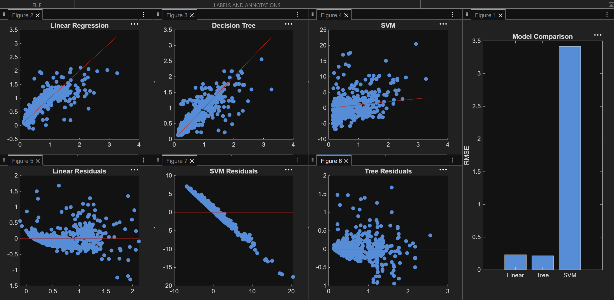

# Rutgers Machine Learning Project - Wastewater Treatment

This was a Rutgers School of Engineering team project for the class ID3A II focused on using machine learning to predict dissolved oxygen levels in a wastewater treatment system.

I led my team of 3 other students and wrote the MATLAB code used to process the data, train the models, compare their performance, and visualize the results.

## Example Results

The plots show the actual vs. predicted values, residuals, and RMSE comparison between the three models.

Because the train/test split is randomized, the exact results may vary slightly between runs.

## How It Works

The program uses the following wastewater treatment variables as inputs:

- Influent flow rate
- Airflow rates across five treatment stages
- Temperature

The program predicts the dissolved oxygen level at the first treatment stage.

Three regression models are compared:

1. Linear regression
2. Decision tree regression
3. Support vector machine (SVM) regression

The dataset is randomly divided into 80% training data and 20% testing data.

Each model is evaluated using:

- RMSE
- R²
- Actual vs. predicted plots
- Residual plots

## Project Files

- `wastewater_ml_model.m` - MATLAB code for loading the data, training the models, evaluating performance, and generating plots
- `all_data.csv` - Wastewater treatment dataset used by the program
- `ID3A_ML_Project_Graphs.png` - Example output from one run of the program

## How to Run

1. Download the repository.
2. Place `wastewater_ml_model.m` and `all_data.csv` in the same folder.
3. Open `wastewater_ml_model.m` in MATLAB.
4. Make sure the **Statistics and Machine Learning Toolbox** by MathWorks is installed.
5. Run the script.

The SVM model can be disabled by changing:

runSVM = true;

to:

runSVM = false;

# Skills Used

MATLAB, machine learning, regression modeling, data analysis, model evaluation, RMSE, R², residual analysis, data visualization, and team leadership.
